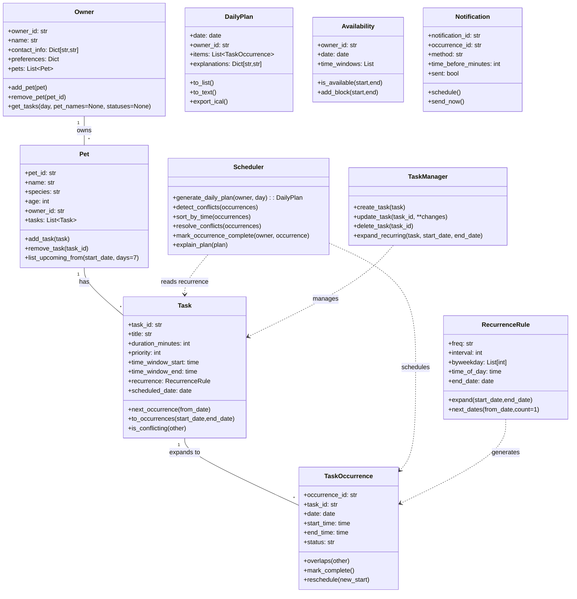

# PawPal+ Project Reflection

## 1. System Design

- Core user actions (plain language):
	- Add a person and their pet so the app knows who to plan for.
	- Add or edit pet care tasks (feedings, walks, meds), including how long they take and how important they are.
	- Ask for today's plan to see the ordered tasks, avoid overlaps, and get a short explanation.

**Mermaid UML (draft)**

**a. Initial design**

I chose these classes and kept responsibilities simple:

- `Owner` — Holds owner id, name, contact info, preferences, and a list of their pets. Methods: add/remove a pet, get tasks for a day.
- `Pet` — Holds pet id, name, species, age, owner id, and its tasks. Methods: add/remove task and list upcoming tasks.
- `Task` — Represents a care task (feed, walk, meds). Holds task id, title, duration (minutes), priority, optional time window, and an optional recurrence rule. Methods: find next occurrence, check conflict with another task, expand to occurrences.
- `TaskOccurrence` — A concrete scheduled instance of a `Task` for a specific date/time. Holds occurrence id, task id, date, start/end times, and status. Methods: check overlap, mark complete, reschedule.
- `TaskManager` — Simple storage and helpers for creating/updating/deleting tasks and for expanding recurring tasks into actual occurrences for a date range.
- `Scheduler` — Builds a `DailyPlan` for an owner: collects task occurrences, orders them by priority/time, detects and resolves conflicts, and returns a plan with short explanations.
- `RecurrenceRule` — Small helper describing repeat rules (daily/weekly/interval/byweekday/time/end_date) used by `Task`.
- `Availability` — Owner's available time windows for a date; used by the scheduler when placing tasks.
- `DailyPlan` — Container for scheduled `TaskOccurrence` items plus brief explanations for why items are ordered that way.
- `Notification` — Optional reminder objects tied to occurrences (method, time-before, sent flag).

These classes map directly to the skeleton in `pawpal_system.py` and keep data and behavior separated: dataclasses hold data, `TaskManager` handles CRUD/expansion, and `Scheduler` handles planning logic.

**b. Design changes**

No structural changes were made. AI helped fix wording and added docstrings to method stubs, but the class responsibilities and relationships stayed as originally designed.

---

## 2. Scheduling Logic and Tradeoffs

**a. Constraints and priorities**

The scheduler considers two main constraints: **start time** and **priority**. Tasks are first sorted chronologically by `start_time` so the plan flows naturally through the day. When two tasks overlap, **priority** decides the winner — the higher-priority occurrence is kept and the lower-priority one is skipped with an explanation. I chose these two because they are the most directly actionable for a pet owner: time tells you *when* something happens, and priority tells you *what matters most* if you can't do everything. Owner availability and recurrence end dates are also respected, but time and priority are the primary scheduling levers.

**b. Tradeoffs**

- **Tradeoff:** The scheduler uses a simple greedy, priority-first conflict resolution: when two occurrences overlap it keeps the higher-priority item and skips the other instead of attempting to search for an optimal rearrangement or small time shifts.
- **Why reasonable:** This keeps the planner deterministic and easy to reason about for an MVP — it's fast, easy to test, and predictable for users. More advanced strategies (search/optimization or automatic shifting) add complexity and edge cases; they can be added later once the core UX is stable.

---

## 3. AI Collaboration

**a. How you used AI**

I used VS Code Copilot (chat and inline suggestions) as a development partner across planning, implementation, testing, and refactoring.

- **Design & scaffolding:** Copilot helped draft class stubs and suggested method names and signatures while I translated the UML into dataclasses.
- **Implementation:** I used Copilot Chat to generate candidate implementations (recurrence expansion, occurrence generation, and sorting helpers) and to propose small refactors such as factoring time parsing into a helper and clarifying docstrings.
- **Testing and debugging:** Copilot drafted unit-test skeletons and suggested edge cases (same-start-time tie-breakers, no-tasks, recurrence end_date), which I adapted and ran locally.

The most helpful prompts were specific and action-oriented, such as "Generate tests for scheduling sorting, recurrence, and conflict detection" and "How should I surface conflicts in the UI for a pet owner?" Including short examples and expected behaviors in prompts consistently yielded the best results.

**b. Judgment and verification**

One clear rejection: Copilot suggested a more complex optimization-based scheduler (constraint solver / backtracking) during an early refactor. I rejected it for the MVP because it would increase surface area, testing burden, and make behavior unpredictable for users.

How I evaluated suggestions:

- I reviewed proposed code for clarity and testability, favoring deterministic behavior (greedy priority-based resolution) over opaque optimizers.
- I wrote focused unit tests for any non-trivial behavior the AI produced and used test failures or static inspection to decide whether to accept, adapt, or discard the suggestion.

Separating work into chat sessions per phase (design, implement, test) helped keep context narrow and prevented ideas from one phase bleeding into another.

---

## 4. Testing and Verification

**a. What you tested**

- **Sorting correctness:** `Scheduler.sort_by_time` orders occurrences by start time and applies a priority tie-breaker for same-time tasks.
- **Recurrence handling:** completing a daily recurring occurrence creates a next-day one-off task via `Scheduler.mark_occurrence_complete`.
- **Conflict detection:** `Scheduler.detect_conflicts` finds overlapping `TaskOccurrence`s and the planner skips lower-priority items.

These tests matter because they cover the core algorithmic behaviors that make PawPal+ "smart" — ordering, recurring task lifecycle, and safety when tasks overlap.

**b. Confidence**

I rate the current implementation 4/5 for covered behaviors. Unit tests pass for all main flows, but broader real-world inputs need more coverage.

Next edge cases to test:
- Malformed or string-formatted `start_time` values.
- Recurrence with `byweekday` lists and intervals greater than 1.
- Owner availability windows that block proposed occurrences.
- Multiple pets with overlapping tasks.

---

## 5. Reflection

**a. What went well**

Rapid iteration was the highlight. Copilot accelerated routine code writing (dataclass fields, small helpers) and test scaffolding, letting me focus on design decisions and verification rather than boilerplate.

**b. What you would improve**

- Add CI that runs tests and a lint step, and expand tests to capture malformed inputs and availability constraints.
- Consider a small scheduler simulation harness to validate behavior across multiple days and many pets.

**c. Key takeaway**

Being the "lead architect" means curating AI suggestions: choose solutions that balance user value, testability, and maintainability. Use AI to generate options and drafts, but validate with focused tests and prefer simple, auditable algorithms for an MVP. AI sped up the mechanics; human judgment guided design, tradeoffs, and verification.
