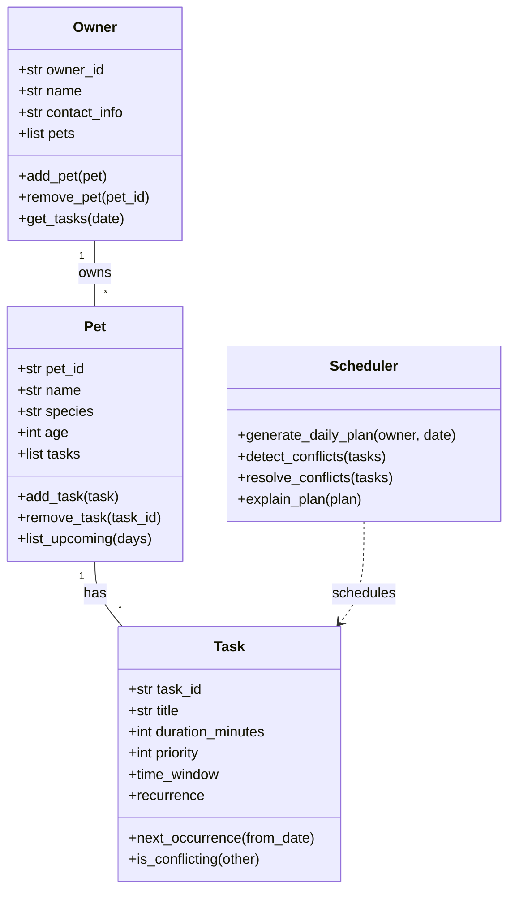

# PawPal+ Project Reflection

## 1. System Design

- Core user actions (plain language):
	- Add a person and their pet so the app knows who to plan for.
	- Add or edit pet care tasks (feedings, walks, meds), including how long they take and how important they are.
	- Ask for today's plan to see the ordered tasks, avoid overlaps, and get a short explanation.
 - Core user actions (plain language):
 	- Add a person and their pet so the app knows who to plan for.
 	- Add or edit pet care tasks (feedings, walks, meds), including how long they take and how important they are.
 	- Ask for today's plan to see the ordered tasks, avoid overlaps, and get a short explanation.

**Mermaid UML (draft)**

**a. Initial design**

I chose these classes and kept responsibilities simple:

- `Owner` — Holds owner id, name, contact info, preferences, and a list of their pets. Methods: add/remove a pet, get tasks for a day.
- `Pet` — Holds pet id, name, species, age, owner id, and its tasks. Methods: add/remove task and list upcoming tasks.
- `Task` — Represents a care task (feed, walk, meds). Holds task id, title, duration (minutes), priority, optional time window, and an optional recurrence rule. Methods: find next occurrence, check conflict with another task, expand to occurrences.
- `TaskOccurrence` — A concrete scheduled instance of a `Task` for a specific date/time. Holds occurrence id, task id, date, start/end times, and status. Methods: check overlap, mark complete, reschedule.
- `TaskManager` — Simple storage and helpers for creating/updating/deleting tasks and for expanding recurring tasks into actual occurrences for a date range.
- `Scheduler` — Builds a `DailyPlan` for an owner: collects task occurrences, orders them by priority/time, detects and resolves conflicts, and returns a plan with short explanations.
- `RecurrenceRule` — Small helper describing repeat rules (daily/weekly/interval/byweekday/time/end_date) used by `Task`.
- `Availability` — Owner's available time windows for a date; used by the scheduler when placing tasks.
- `DailyPlan` — Container for scheduled `TaskOccurrence` items plus brief explanations for why items are ordered that way.
- `Notification` — Optional reminder objects tied to occurrences (method, time-before, sent flag).

These classes map directly to the skeleton in `pawpal_system.py` and keep data and behavior separated: dataclasses hold data, `TaskManager` handles CRUD/expansion, and `Scheduler` handles planning logic.

**b. Design changes**

No changes made, AI just fixed wording ad added '' for functions.

---

## 2. Scheduling Logic and Tradeoffs

**a. Constraints and priorities**

- What constraints does your scheduler consider (for example: time, priority, preferences)?
- How did you decide which constraints mattered most?

**b. Tradeoffs**

- Describe one tradeoff your scheduler makes.
- Why is that tradeoff reasonable for this scenario?

- **Tradeoff:** The scheduler uses a simple greedy, priority-first conflict resolution: when two occurrences overlap it keeps the higher-priority item and skips the other instead of attempting to search for an optimal rearrangement or small time shifts.
- **Why reasonable:** This keeps the planner deterministic and easy to reason about for an MVP — it's fast, easy to test, and predictable for users. More advanced strategies (search/optimization or automatic shifting) add complexity and edge cases; they can be added later once the core UX is stable.

---

## 3. AI Collaboration

**a. How you used AI**

- How did you use AI tools during this project (for example: design brainstorming, debugging, refactoring)?
- What kinds of prompts or questions were most helpful?

**b. Judgment and verification**

- Describe one moment where you did not accept an AI suggestion as-is.
- How did you evaluate or verify what the AI suggested?

---

## 4. Testing and Verification

**a. What you tested**

- What behaviors did you test?
- Why were these tests important?

**b. Confidence**

- How confident are you that your scheduler works correctly?
- What edge cases would you test next if you had more time?

---

## 5. Reflection

**a. What went well**

- What part of this project are you most satisfied with?

**b. What you would improve**

- If you had another iteration, what would you improve or redesign?

**c. Key takeaway**

- What is one important thing you learned about designing systems or working with AI on this project?
